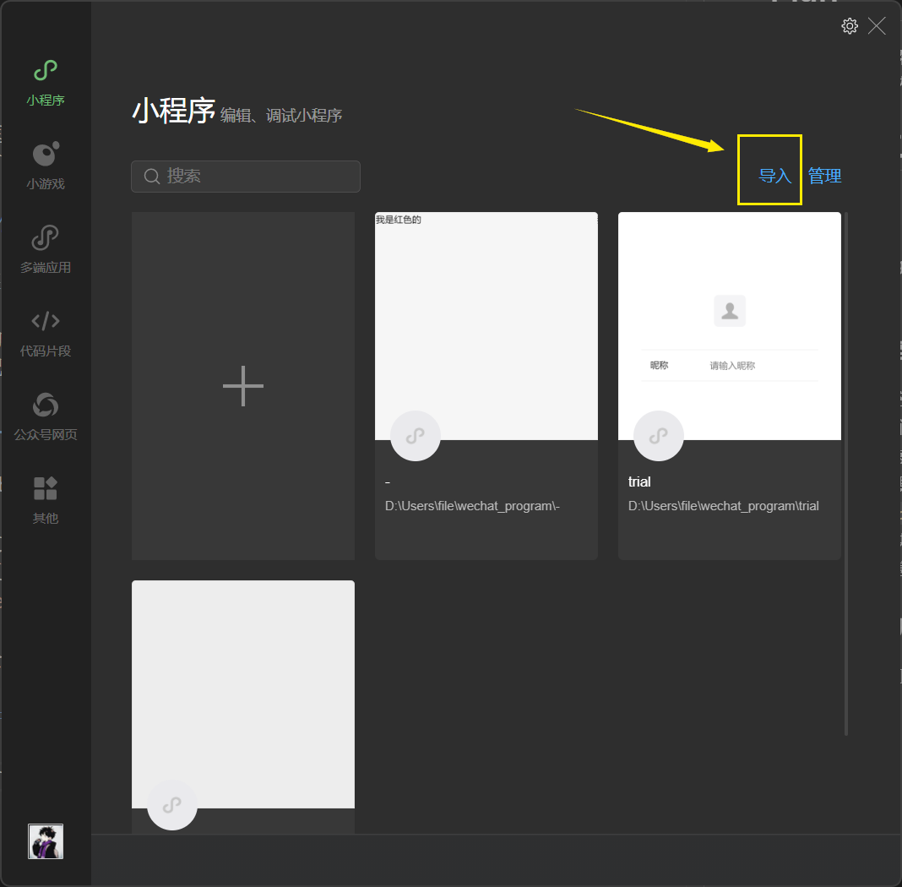
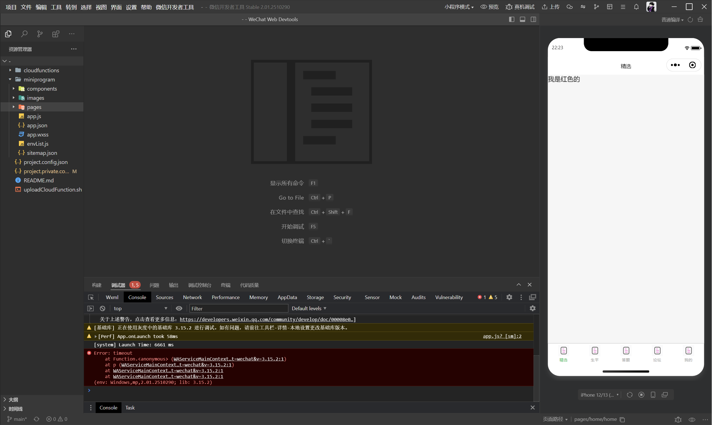
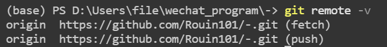
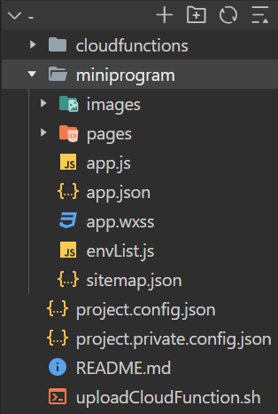
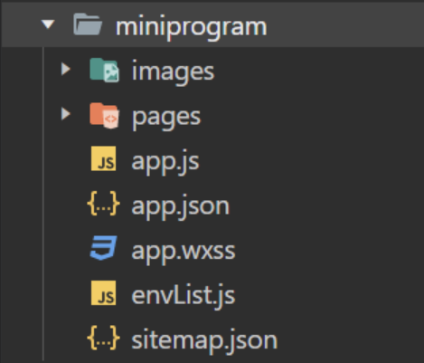
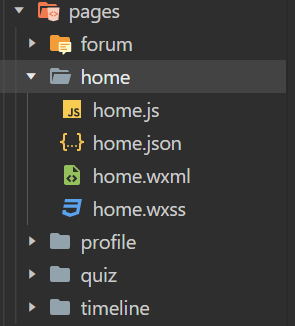
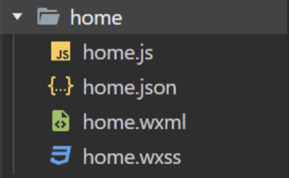
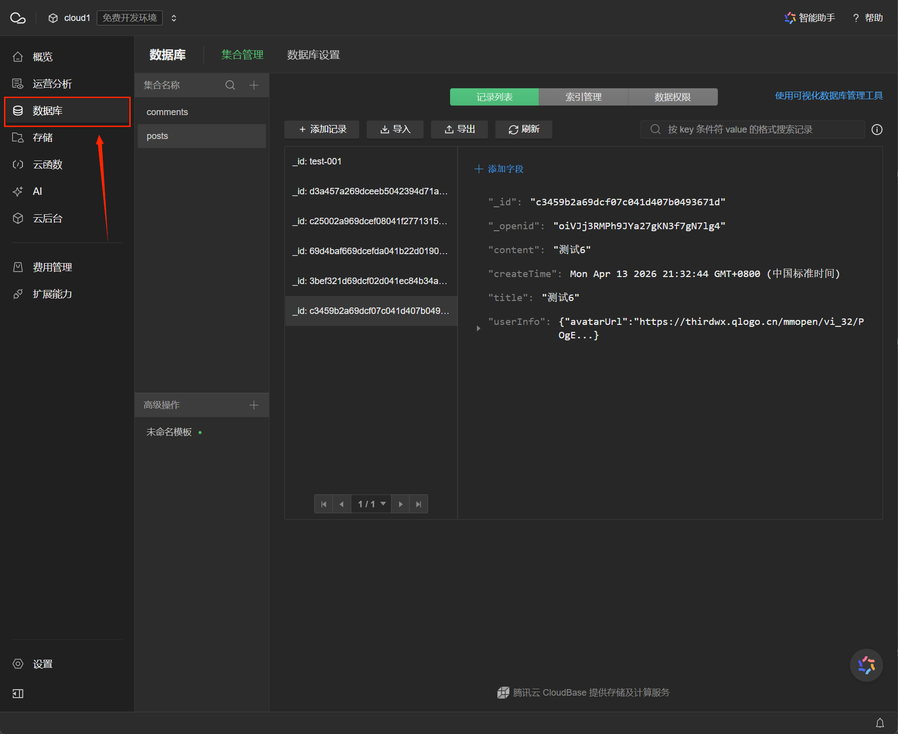

# *会议Review*

## 一、 开发技术栈

- 建立以 *git* 为基础的协同开发方式，并在 *Github* 建立项目仓库，这个可以组长用自己的账号创立一个仓库，然后我们使用git和仓库进行交互就可以


## 二、 内容设计 

分成五个页面：

|页面|形式|内容|交互方式|
|:--:|:---|:---|:-----|
|一|参考小红书的帖子的基础形式|来自njutable|点击帖子，进入材料主页；可发帖|
|二|生平时间线|来自额外搜索整理|点击时间点，跳出小窗显示相应事迹|
|三|答题，积分机制|来自生成题目|答题，提交后返回分数及排行榜界面|
|四|论坛|来自用户上传|网友可以自由发挥表达|
|五|个人主页|比如我的帖子，排行，等|同微信个人中心|

## 三、 分工

- 具体操作方法依赖代码框架，下文plan部分会给出具体的操作方式


# *后期 Plan*

现在代码逻辑框架已经研究好并且基本框架搭建完成，相关基本功能的测试也已经完成，然后下面的内容主要是说明如何看这个项目文件夹中的文件：

## 一、建立工作流

### 1. 工具链  

首先拥有自己的github账户，并且将其与本地git进行绑定（第一次使用git的时候会有需要配置的环节）

先简单说明一下本地git工作时的一些注意点：

1. `add`命令我们可以直接执行`git add .`把项目文件夹中的全部文件加入暂存区，捆绑为一个版本

2. `commit`命令执行`git commit -m "你为这次提交起的名字"`这里的名字可以用中文，简单说明实现的功能，或者微调的内容，直观明了

### 2. 文件clone到本地

将自己的Github名称告知组长，让他将我们添加到 collaborator 中（源仓库在组长账户下），添加时我们会在邮箱（注册Github账户时使用的邮箱）中收到一个是否接收邀请的邮件，选接受就ok，这样我们才有权限在本地与该项目仓库进行直接交互，有了权限之后，我们只需要到一个自己喜欢的文件夹下 ： 

执行 `git clone https://github.com/Rouin101/-.git` 命令  

(如果提示超时连接失败(这很常见)，可以打开加速器干预DNS解析来加速)

这样就会在你喜欢的文件夹中创建出一个新的名为`-`的文件夹（组长创建仓库的时候临时随机用的名字，不必在意）

### 3. 在IDE中打开

打开微信开发者工具，选择导入 



然后找到刚刚创建的名为 `-` 的文件夹，选择他，然后点击创建之后，就会进入开发页面：



这里就是未来开发的IDE

快捷键：``` ctrl+` ```(右边的键在键盘左上角)可以直接调出终端

### 4. 建立与仓库的交互

在终端中执行：`git remote -v`

应该会显示两行，表示我们和仓库建立了联系



> 如果没有显示，就手动添加（正常clone的话是会自动关联的）
>
> 执行：`git remote add origin https://github.com/Rouin101/-.git`
>
> 然后再执行上面的`-v`命令，应该就好了

#### 下面的内容是重点，说明多人协作的工作方式（这里选择了比较安全，稍微方便的一种）

1. 首先在main分支上执行`git pull`将云仓库的记录拉到本地，同时更新main分支，此时本地显示的文件内容就是最新的版本  
*（要在main分支执行pull命令才会自动更新main分支，否则main分支暂时是不会变化的）*

2. 然后为了安全，我们需要自己创建一个新分支进行工作。在这个最新版本基础上，执行`git checkout -b (分支名)`,为了方便，我们创建的分支尽量以各自的page名称命名，比如说负责home页的同学创建的分支就可以执行`git checkout -b bran_home1`，同理有`bran_timeline1`等  
*  `git checkout -b (分支名)`这个命令是创建分支并切换到该分支上，拆成两个命令就是`git branch (分支名)`创建分支，然后`git switch (分支名)`切换到对应分支

3. 然后在创建的该分支上完成相应工作后，确认**自己页面功能正常，且并没有影响其他页面显示及功能的情况下（只要不动别人文件夹和全局配置文件，一般不会有事）**，先commit本地版本，后就可以执行`git push origin (分支名)`，比如`git push origin bran_home1`将这个本地的bran_home分支推送到云端，由我和学长来帮大家再次确认并合并

4. 为了保留大家的工作记录，我们不进行清理工作，会在仓库中保留大家创建的分支及含有的记录，作为纪念。然后如果下次想要继续修改自己的页面，就可以重复上述操作过程，只不过创建分支的名字可以叫做`bran_home2`加数字标加以区分
## 二、关于文件夹结构的说明

这部分简单介绍一下文件夹中的文件结构，以及和小程序功能的对应关系，方便大家先建立一个稍微清晰的认识，不至于无从下手

### 1. 根目录文件结构
  

`-`是项目根目录，下面有这样一些内容：

- `cloudfunctions`文件夹  
里面包含了部分已经定义好的云函数，当然也可以右键自己新建node.js云函数，用于后端数据计算（比如答题积分就依赖云函数计算）


- `miniprogram`文件夹

- 以及最下面四个文件
    
    - `README.md`文件是会显示在云仓库中的说明文字，`photos`文件夹是README.md中使用的图片，这两个和项目没有关系，各位不用管
    
    - 另外三个一般是不用动的

> #### *此项目中我们主要需要操作的是`miniprogram`文件夹，但是有时也需要操作cloudfunctions文件夹*

### 2. 深入一步，*miniprogram*文件夹结构

下面我们就来看看我们主要的工作文件夹：



`miniprogram`下有这样一些内容，其中前两个文件夹尤为重要：

- `images`**文件夹**  
该项目中所有可能用到的图片都统一的放在这里，下面可以自建文件夹，自由度非常高（各位自由定制即可）  
目前文件夹中的我已创建了一个名为`bottom-icons`的文件夹，里面存储了小程序底部栏的图标（未点击与点击，当然测试需要，里面是一种图片的十个副本，后面需要靠大家推荐图标，然后更换）
- `pages`**文件夹**  
该文件夹中的就是所有页面了(下面的五个文件夹就是我们的五个页面了),每个文件夹下都是四种类型的文件，这是大家后面代码工作的具体地点，具体我们后文会继续说明



- `app.js`  
js文件，程序实例入口，可以定义全局数据对象，比如用户登录信息等等，**各位可以不动**
- `app.json`  
json文件，页面注册，顶部窗口样式设计，底部栏样式设计等，在这里完成，作用于所有页面，可被页面下的json文件覆盖，**后面需要进一步设计装饰**
- `app.wxss`  
wxss文件(等同于css，页面的“化妆师”),全局页面样式文件，作用于所有页面，可以被页面下的wxss文件覆盖，**后面可以再设计**
- `envList.js`  
环境列表，**可以不用管**
- `sitemap.json`  
微信爬虫的指导文件，关乎小程序能不能被搜索到，**需要后期配置**

### 3. 再深入一步，每一个page的文件夹

以`home`文件夹为例：



首先`js`,`wxml`,`wxss`三个文件是与网页`js`,`html`,`css`基本等价的变体  
其次`json`文件是配置顶部窗口，引入组件的文件

下面可以再具体说明一下：

- `wxml`文件  
网页内容的骨架，内容在这里呈现

- `js`文件  
处理页面内的用户交互逻辑，比如点击按钮出现弹窗等等

- `wxss`文件  
设计页面样式，颜色，背景，大小，布局，页面的“化妆师”

- `json`文件  
设计顶部窗口，引入组件，下拉刷新等配置

大家在操作的时候基本ai一定会同时给到前三个文件的代码，因为他们的耦合很紧密，直接粘贴到对应文件中就可以  
(传统方式 html , css , js 三个文件其实都是在一个 html 文件中写的，不过拆开后结构更加清晰整齐，代码可维护性更好，所以这里也同样的拆成了三个文件，在这里很特殊会自动外联式引用，无需import和link)

## 三、 与数据库的交互方式 

当我们需要对内容进行存储的时候，就需要与数据库进行交互了（比如网友的发帖，如果不存储，下次打开就没有了）

不过微信开发提供了一个非常方便的云数据库，不需要写数据库代码，不需要ORM，文档型数据库直接操作就可以了：


点击这个云图标



点击数据库，创建集合，添加记录选择json模式，然后自定义字段即可

这个部分到时候跟AI说明清楚，让他指导操作就可以

## 四、具体分工

我们主要操作pages下的那五个文件夹，并列的基本互不干扰，这个框架下，我们可能分工不再按照前后端了，更适合按照页面进行分工，五个页面，大家可以自己选一下，下面是复杂度参考(评定主要是逻辑上的复杂度，或者说开发过程中调整代码时可能牵动内容的多少)：

|页面|操作内容|复杂度|
|:--|:---:|---:|
|一|汇总table内容，做成帖子形式展示(静态数据)<br>可以继续发帖，帖子评论功能(后端数据库交互)|HIGH|
|二|收集信息展示生平数据(纯静态数据)|EASY|
|三|答题，积分(前端js交互，后端定义云函数)<br>排行榜(后端数据库记录)|high|
|四|发说说，评论(可以压缩到前端展示及交互，后端数据库存储)|high|
|五|个人中心，交互式展示部分信息(具体可以再进一步商议展示什么内容)|easy|

**HIGH > high > easy > EASY*

